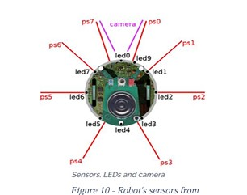
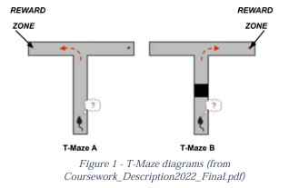
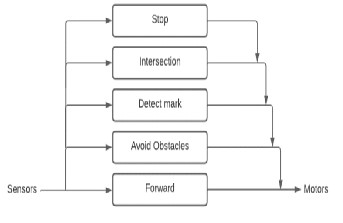
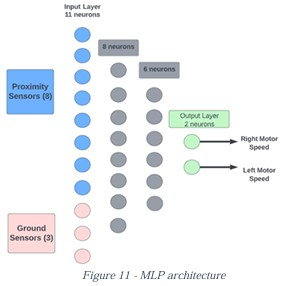
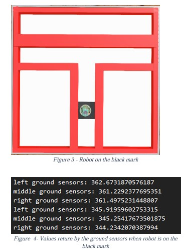
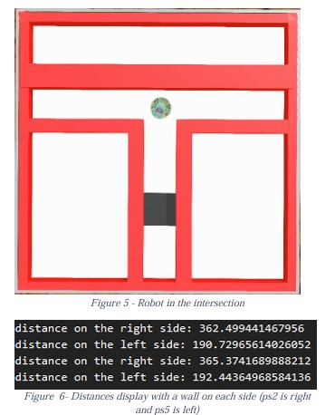

# Intelligent Robotics - e-Puck Robot in a T-Maze

## Table of Contents
- [Introduction](#introduction)
- [Methodology](#methodology)
  - [Behaviour-Based Robotics (BBR)](#behaviour-based-robotics-bbr)
  - [Evolutionary Robotics (ER)](#evolutionary-robotics-er)
- [Implementation](#implementation)
- [Results](#results)
- [Conclusion](#conclusion)
- [References](#references)

---

## Introduction
This project explores the implementation of two different methodologies to navigate an **e-Puck robot** through a **T-Maze**:
- **Behaviour-Based Robotics (BBR)**: Uses a subsumption architecture for predefined decision-making.
- **Evolutionary Robotics (ER)**: Uses a **Genetic Algorithm (GA)** to train a **feed-forward neural network (MLP)** to control the robot’s movement.

The **Webots** simulation software (R2022b) was used for development and testing.

---

## Methodology

### Behaviour-Based Robotics (BBR)
BBR operates through a hierarchical subsumption architecture, where behaviors are ranked in order of significance.

The robot's behaviors include:
1. Moving forward
2. Avoiding obstacles
3. Detecting ground marks
4. Turning at intersections
5. Stopping at the end of the maze


### Evolutionary Robotics (ER)
In ER, a **feed-forward neural network** is trained using a **Genetic Algorithm (GA)**.

**MLP Architecture:**
- **Inputs**: 8 proximity sensors + 3 ground sensors
- **Hidden Layers**: 8 and 6 neurons
- **Outputs**: Left and right motor speeds
- **Activation Function**: `tanh`


#### Genetic Algorithm Configuration:
- **Population Size**: 50
- **Generations**: 80
- **Crossover Rate**: 0.8
- **Mutation Rate**: 0.1
- **Elitism**: Top 10% retained each generation

---
## Implementation

### Fitness Function
The fitness function is composed of three components:

#### 1. Forward Movement Fitness:
$$
Forward\ Fitness = \frac{velocity_{left} + velocity_{right}}{2}
$$

#### 2. Avoid Collision Fitness:
$$
Avoid\ Collision = 1 - 1.7 \times (\max(proximity\ sensor\ values))^2
$$

#### 3. Avoid Spinning Fitness:
$$
\text{if } |velocity_{left} - velocity_{right}| > 1.8, \ fitness -= 1
$$
$$
\text{if } |velocity_{left} - velocity_{right}| < 1.8, \ fitness += 1
$$

#### Combined Fitness Function:
$$
Combined\ Fitness = 5 \times Forward\ Fitness + 7.5 \times Avoid\ Collision + 7.5 \times Avoid\ Spinning
$$

#### Reward Function:
For black mark present:
$$
Reward = 25 \times displacement_x + 75 \times displacement_z
$$
For no black mark:
$$
Reward = -25 \times displacement_x + 75 \times displacement_z
$$

**Final Fitness Calculation:**
$$
Fitness = \frac{Combined\ Fitness + Reward}{10}
$$
$$
Final\ Fitness = e^{Fitness}
$$

---
## Results

**Performance of BBR vs ER:**

| Task  | Maze Type | BBR Time (s) | ER Time (s) |
|-------|----------|-------------|------------|
| Task 1 | Maze A | 8.8 | 20.2 |
| Task 1 | Maze B | 8.9 | 19.56 |
| Task 2 | Maze A | - | 20.2 |
| Task 2 | Maze B | - | 19.56 |

- **BBR performed faster** due to predefined behaviors.
- **ER took longer** as it needed training but was **more adaptable**.

---

## Conclusion
- **BBR** is ideal for structured environments with known behaviors.
- **ER** is effective for complex environments where learning from experience is required.
- GA parameters (mutation rate, crossover rate, fitness function tuning) significantly impact ER performance.

---

## References
1. Goldberg, D. *Genetic Algorithms in Search, Optimization, and Machine Learning* (1989).
2. Brooks, R. "A Robust Layered Control System for a Mobile Robot," IEEE Journal (1986).
3. [Cyberbotics e-Puck Guide](https://cyberbotics.com/doc/guide/epuck)
4. Doncieux, S. "Evolutionary Robotics: What, Why, and Where to," *Frontiers in Robotics and AI* (2015).

---

## Images
### Puck Sensors


### T-Maze Diagram

### Subsumption Architecture

### MLP Network 

### Initial Position

### Mid Position


---

## How to Run
1. Clone this repository:
   ```sh
   git clone https://github.com/your-repo/intelligent-robotics.git
   ```
2. Navigate to the project folder:
   ```sh
   cd intelligent-robotics
   ```
3. Open Webots and run the provided simulation files.

Enjoy exploring robotics intelligence!

